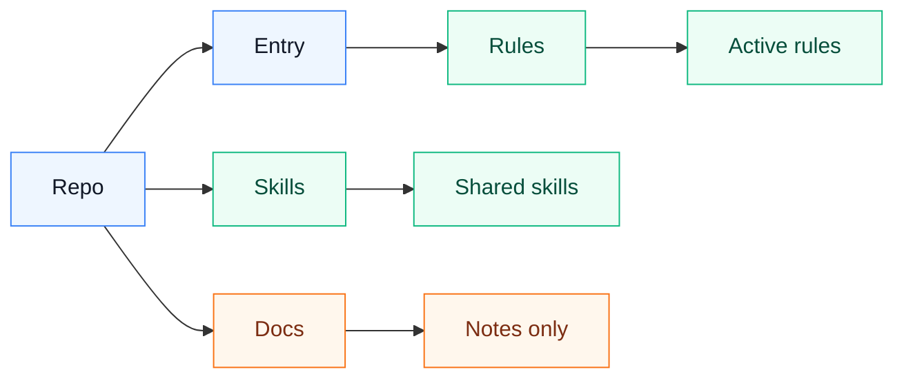

# ai-agent

Personal AI agent rules, skills, and sync notes.

This repository stores portable agent guidance that can be shared between Windows and macOS machines. It intentionally excludes local CLI configuration, credentials, sessions, logs, caches, and company/project-specific files.

## Directory Boundary

`AGENTS.md` is the shared rule entry. `rules/` stores shared behavior rules. `skills/` stores personally maintained skills. `docs/` is only explanatory material and is not loaded by the agents.



`Entry` is `AGENTS.md`, `Rules` is `rules/*.md`, `Skills` is `skills/<skill-name>/`, and `Docs` is `docs/*.md`.

## Contents

Shared rules:

- `rules/communication-rules.md`: collaboration and response rules
- `rules/security-and-privacy-rules.md`: security, privacy, and sync boundary rules
- `rules/markdown-rules.md`: Markdown writing and diagram rules
- `rules/coding-rules.md`: coding rules
- `rules/testing-rules.md`: testing and verification rules
- `rules/skill-rules.md`: skill trigger and loading rules
- `rules/openclaw-rules.md`: OpenClaw troubleshooting rules
- `rules/project-governance.md`: project and personal-rule governance rules
- `rules/mcp-output-rules.md`: MCP result output rules
- `rules/requirements-and-prototype.md`: requirements and prototype rules

On each machine, expose these rule files to each agent by per-file symlink:

```text
~/.codex/rules/*.md
~/.claude/rules/*.md
~/.openclaw/workspace/rules/*.md
~/.hermes/rules/*.md
```

Do not symlink the whole `rules/` directory. `~/.codex/rules/default.rules` is local command approval history and must stay outside this repository.

Use the native entry for each tool to load the shared `AGENTS.md`:

- Codex: `~/.codex/AGENTS.md -> ~/ai-agent/AGENTS.md`
- Claude Code: `~/.claude/CLAUDE.md` references `~/.claude/AGENTS.md -> ~/ai-agent/AGENTS.md`
- OpenClaw: `~/.openclaw/workspace/AGENTS.md -> ~/ai-agent/AGENTS.md`
- Hermes: `$HERMES_HOME/SOUL.md` references `$HERMES_HOME/AGENTS.md -> ~/ai-agent/AGENTS.md`

The active shared entry file should reference the rule files in `rules/`. Do not reference files in `docs/`.

Do not maintain public per-platform global entry templates. Platform differences belong in local private configuration, environment variables, or cross-platform scripts that detect the host at runtime.

Shared custom skills are stored under `skills/`. Do not symlink an entire tool skill directory into this repository; only add skills you personally maintain and have reviewed for public sync.

Codex and Claude can expose those shared skills through per-skill symlinks. Hermes should list each shared skill directory in `skills.external_dirs`. OpenClaw should list each shared skill directory in `skills.load.extraDirs`; workspace skill symlinks that resolve outside the workspace are rejected as `symlink-escape`.

Cross-device notes:

- `docs/agent-sync.md`: sync layout and installation notes
- `docs/file-map.md`: file classification and migration map
- `docs/do-not-sync.md`: files and directories that must never be synced
- `docs/symlink-design.md`: rule and skill symlink design

Project rules do not live in this global repository. Put them inside the target project:

```text
<project>/
  AGENTS.md
  .codex/
    rules/
      *.md
```

## Security

Do not commit:

- `~/.codex/config.toml`
- `~/.codex/local/`
- auth files, tokens, cookies, browser sessions
- command approval history
- logs, sqlite databases, caches, temporary files
- company or internal project configuration

Each machine should keep its own CLI configuration and private local files.
