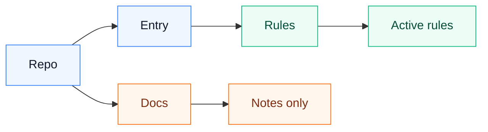

# ai-agent

Personal AI agent rules and sync notes.

This repository stores portable Codex agent guidance that can be shared between Windows and macOS machines. It intentionally excludes local CLI configuration, credentials, sessions, logs, caches, and company/project-specific files.

## Directory Boundary

`rules/` is the only rule directory in this repository. `docs/` is only explanatory material and is not loaded by Codex.



`Entry` is `AGENTS.md`, `Rules` is `rules/*.md`, and `Docs` is `docs/*.md`.

## Contents

Global Codex rules:

- `rules/communication-rules.md`: collaboration and response rules
- `rules/security-and-privacy-rules.md`: security, privacy, and sync boundary rules
- `rules/markdown-rules.md`: Markdown writing and diagram rules
- `rules/coding-rules.md`: coding rules
- `rules/testing-rules.md`: testing and verification rules
- `rules/openclaw-rules.md`: OpenClaw troubleshooting rules
- `rules/project-governance.md`: project and personal-rule governance rules
- `rules/mcp-output-rules.md`: MCP result output rules
- `rules/requirements-and-prototype.md`: requirements and prototype rules

On each machine, install these rule files into the Codex home rules directory:

```text
~/.codex/rules/*.md
```

Use one shared Codex global entry template:

- `AGENTS.md`: copy to `%USERPROFILE%\.codex\AGENTS.md` on Windows or `~/.codex/AGENTS.md` on Mac

The active Codex global entry file should reference the rule files in `rules/`. Do not reference files in `docs/`.

Do not maintain public per-platform global entry templates. Platform differences belong in local private configuration, environment variables, or cross-platform scripts that detect the host at runtime.

Cross-device notes:

- `docs/codex-sync.md`: sync layout and installation notes
- `docs/file-map.md`: file classification and migration map
- `docs/do-not-sync.md`: files and directories that must never be synced

Project rules do not live in this global repository. Put them inside the target project:

```text
<project>/
  AGENTS.md
  .codex/
    rules/
      *.md
```

## Security

Do not commit:

- `~/.codex/config.toml`
- `~/.codex/local/`
- auth files, tokens, cookies, browser sessions
- command approval history
- logs, sqlite databases, caches, temporary files
- company or internal project configuration

Each machine should keep its own Codex CLI configuration and private local files.
