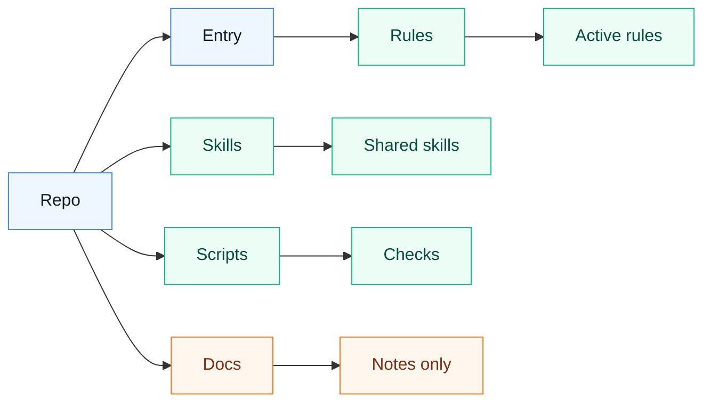

# ai-agent

Shared AI agent rules, skills, and workflow notes.

This repository stores portable agent guidance that can be shared across machines and contributors. It intentionally excludes local CLI configuration, credentials, sessions, logs, caches, and company/project-specific files. Each user keeps their own private configuration outside Git.

The planned team home is `team-agent-workflow/ai-agent`. Until the repository is transferred, the local working copy can keep the same directory path and only the Git remote needs to change after transfer.

## Quick Start

1. Clone the repository.
2. Read `docs/onboarding.md`.
3. Run `python3 scripts/doctor.py` to inspect local setup.
4. Link `AGENTS.md` and `rules/*.md` into your own agent tool home.
5. Opt in to only the maintained skills you need.
6. Put private configuration in your local tool config directory, not in this repository.
7. Run `python3 scripts/verify_agent_rules.py` before opening a pull request.

Print the Codex rule link plan without changing files:

```bash
python3 scripts/setup_links.py --tool codex --rules --print-only
```

Link selected skills only when you need them:

```bash
python3 scripts/setup_links.py --tool codex --skills multi-agent-workflow,personal-knowledge --print-only
```

Rule or skill behavior changes must follow `docs/rule-fix-workflow.md`. General contribution rules are in `CONTRIBUTING.md`.
Use `docs/github-transfer-checklist.md` for the GitHub organization transfer steps.

## Directory Boundary

`AGENTS.md` is the shared rule entry. `rules/` stores shared behavior rules. `skills/` stores maintained skills. `scripts/` stores portable verification scripts. `docs/` is only explanatory material and is not loaded by the agents.



`Entry` is `AGENTS.md`, `Rules` is `rules/*.md`, `Skills` is `skills/<skill-name>/`, `Scripts` is `scripts/*.py`, and `Docs` is `docs/*.md`.

## Contents

Shared rules:

- `rules/communication-rules.md`: collaboration and response rules
- `rules/security-and-privacy-rules.md`: security, privacy, and sync boundary rules
- `rules/markdown-rules.md`: Markdown writing and diagram rules
- `rules/coding-rules.md`: coding rules
- `rules/testing-rules.md`: testing and verification rules
- `rules/skill-rules.md`: skill trigger and loading rules
- `rules/openclaw-rules.md`: OpenClaw troubleshooting rules
- `rules/project-governance.md`: project and personal-rule governance rules
- `rules/mcp-output-rules.md`: MCP result output rules
- `rules/requirements-and-prototype.md`: requirements and prototype rules
- `rules/personal-knowledge-rules.md`: Obsidian and personal knowledge capture rules

Shared custom skills:

- `skills/bug/`
- `skills/grafana/`
- `skills/hg-git/`
- `skills/multi-agent-workflow/`
- `skills/personal-knowledge/`
- `skills/publish-gitlab-argo/`
- `skills/requirements-organizer/`
- `skills/rule-fix/`
- `skills/tutorial-writer/`

Shared scripts:

- `scripts/doctor.py`: read-only local setup inspection
- `scripts/setup_links.py`: print or create links for shared rules and selected skills
- `scripts/verify_agent_rules.py`: regression checks for shared rules and managed skills
- `scripts/check_dangerous_deletions.py`: CI guard for protected deletions

## Organization Transfer Impact

Moving the repository to `team-agent-workflow/ai-agent` changes repository ownership and collaboration controls. It does not require changing local agent configuration if the local repository path stays the same.

For an existing machine using `~/ai-agent` or another stable local checkout path:

- Keep the local directory in place.
- Update only the Git remote after the transfer.
- Keep existing symlinks to `AGENTS.md`, `rules/*.md`, and `skills/<skill-name>/`.
- Keep private configuration in each tool's local config directory.

The local workflow changes only when a user pulls shared changes from the repository. Private config, tokens, sessions, MCP settings, and tool-specific local files remain outside Git.

On each machine, expose these rule files to each agent by per-file symlink:

```text
~/.codex/rules/*.md
~/.claude/rules/*.md
~/.openclaw/workspace/rules/*.md
~/.hermes/rules/*.md
```

Do not symlink the whole `rules/` directory. `~/.codex/rules/default.rules` is local command approval history and must stay outside this repository.

Use the native entry for each tool to load the shared `AGENTS.md`:

- Codex: `~/.codex/AGENTS.md -> ~/ai-agent/AGENTS.md`
- Claude Code: `~/.claude/CLAUDE.md` references `~/.claude/AGENTS.md -> ~/ai-agent/AGENTS.md`
- OpenClaw: `~/.openclaw/workspace/AGENTS.md -> ~/ai-agent/AGENTS.md`
- Hermes: `$HERMES_HOME/SOUL.md` references `$HERMES_HOME/AGENTS.md -> ~/ai-agent/AGENTS.md`

The active shared entry file should reference the rule files in `rules/`. Do not reference files in `docs/`.

Do not maintain public per-platform global entry templates. Platform differences belong in local private configuration, environment variables, or cross-platform scripts that detect the host at runtime.

Shared custom skills are stored under `skills/`. Maintained skills use `skills/<skill-name>/` as the source. Do not symlink an entire tool skill directory into this repository; only add skills reviewed for public sync.

Codex and Claude can expose those shared skills through per-skill symlinks. Hermes should list each shared skill directory in `skills.external_dirs`. OpenClaw should list each shared skill directory in `skills.load.extraDirs`; workspace skill symlinks that resolve outside the workspace are rejected as `symlink-escape`.

Skills are opt-in. Many maintained skills depend on company tools, monitoring, release flows, or personal repositories. New members should start with shared rules and add only the skills they actually use.

Machine-specific skill configuration stays local. Shared skill scripts should read local settings from `$CODEX_SKILL_CONFIG_DIR/<skill-name>.local.json` when set, otherwise `~/.codex/local/<skill-name>.local.json`. Do not rely on project-local `.codex/local/<skill-name>.local.json` files as a second active config source.

Cross-device notes:

- `docs/agent-sync.md`: sync layout and installation notes
- `docs/file-map.md`: file classification and migration map
- `docs/do-not-sync.md`: files and directories that must never be synced
- `docs/symlink-design.md`: rule and skill symlink design
- `docs/superpowers/specs/2026-05-17-codex-obsidian-personal-log-design.md`: Codex and Obsidian personal knowledge design

Project rules do not live in this global repository. Put them inside the target project:

```text
<project>/
  AGENTS.md
  .codex/
    rules/
      *.md
```

## Security

Do not commit:

- `~/.codex/config.toml`
- `~/.codex/local/`
- auth files, tokens, cookies, browser sessions
- command approval history
- logs, sqlite databases, caches, temporary files
- company or internal project configuration

Each machine should keep its own CLI configuration and private local files.
