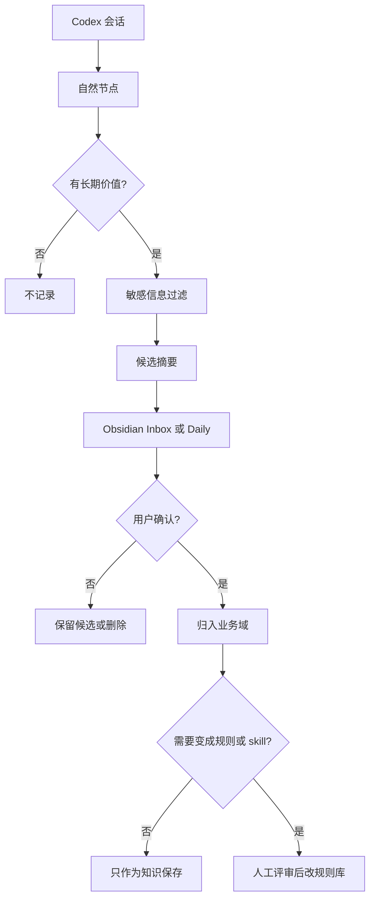

# Codex + Obsidian 个人日志设计

## 背景

目标不是把 Codex 的每次对话都存进 Obsidian，而是把有长期价值的信息沉淀成个人知识。原始会话、工具输出和日志仍然属于运行态私有数据，不进入 Obsidian，不进入个人 GitHub 仓库。

这套设计采用“候选式沉淀”：Codex 在关键节点生成脱敏摘要，先进入候选区；用户确认后，再进入业务域、规则或 skill。

## 设计依据

- OpenAI Agents SDK 的 memory 设计强调摘要、索引和按需恢复，而不是把完整历史长期塞进上下文。
- LangChain 将记忆分成短期记忆和长期记忆，并进一步区分 semantic、episodic、procedural。Obsidian 适合保存 semantic 和 episodic；规则与 skill 属于 procedural，应该留在个人规则仓库。
- MCP 工具规范强调用户确认和安全边界。写入 Obsidian、升级规则或修改 skill 都应走人工确认。
- Obsidian 的 Properties、Daily Notes、Templates 和 Local REST API 能支撑结构化候选条目、每日索引和后续自动化写入。

参考：

- OpenAI Agents SDK Memory: https://openai.github.io/openai-agents-python/sandbox/memory/
- OpenAI Cookbook Session Memory: https://developers.openai.com/cookbook/examples/agents_sdk/session_memory
- LangChain Memory: https://docs.langchain.com/oss/python/concepts/memory
- MCP Tools Specification: https://modelcontextprotocol.io/specification/2025-06-18/server/tools
- Obsidian Properties: https://obsidian.md/help/properties
- Obsidian Local REST API: https://github.com/coddingtonbear/obsidian-local-rest-api

## 范围

本设计覆盖：

- Codex 会话在自然节点生成个人知识候选。
- 候选摘要写入 Obsidian。
- Obsidian 内容按最小业务域整理。
- 经用户确认后，将稳定知识迁移到个人规则或 skill。

本设计不覆盖：

- 全量会话备份。
- 自动读取整个 Obsidian vault 作为上下文。
- 自动把候选内容升级成规则或 skill。
- 用发布编号描述内部方案。
- 公司项目、内部环境、账号、token、cookie、日志原文、接口响应原文和本机绝对路径的归档。

## 总体流程



## Obsidian 结构

```text
AgentKnowledge/
  Daily/
  Inbox/
  01-Agent工作台/
  02-研发实现/
  03-排查与观测/
  04-需求与文档/
  05-交付与验证/
Templates/
  Agent日志候选.md
  Agent每日索引.md
```

业务域保持 5 个，不按单次任务继续拆。弱证据主题先进入 `Inbox`，只有长期重复出现并且难以归入现有域时，才考虑新增顶层域。

## 业务域定义

| 业务域 | 放什么 | 不放什么 |
| --- | --- | --- |
| `01-Agent工作台` | Codex、Claude、Hermes、OpenClaw、gstack、规则、skill、Obsidian 接入 | 单个业务项目的临时处理 |
| `02-研发实现` | 代码实现、重构、工程实践、浏览器自动化 | 未验证想法和一次性命令 |
| `03-排查与观测` | bug、Grafana、日志链路、MCP 数据查询、根因判断 | 原始日志、接口响应和内部标识 |
| `04-需求与文档` | 需求、原型、PRD、技术调研、方案文档 | 纯过程汇报 |
| `05-交付与验证` | 测试、QA、发布、GitHub 同步、dev 发布和回归 | 临时发布地址和凭据 |

## 候选条目模型

候选条目使用 Obsidian Properties：

```yaml
---
type: agent-log-candidate
status: candidate
agent_load: false
domain: Inbox
contexts: []
source: codex
session_date: YYYY-MM-DD
sensitivity: redacted
target: ""
---
```

字段含义：

| 字段 | 含义 |
| --- | --- |
| `type` | 条目类型，候选日志固定为 `agent-log-candidate` |
| `status` | `candidate`、`approved`、`archived` |
| `agent_load` | 是否允许未来 agent 加载，候选必须为 `false` |
| `domain` | 目标业务域 |
| `contexts` | 低敏上下文标签，例如 `codex`、`testing`、`grafana` |
| `source` | 来源工具 |
| `session_date` | 产生日期 |
| `sensitivity` | 脱敏状态 |
| `target` | 如果未来要升级，写目标规则或 skill 名称 |

正文只保存四类内容：

- 摘要：这次形成了什么可复用信息。
- 决策：用户明确确认了什么偏好或边界。
- 证据：不敏感、可复述的依据。
- 待处理：是否需要迁移到规则或 skill。

## 有意义判断

进入 Obsidian 的最低门槛：

- 它能减少后续重复沟通。
- 它能指导未来 agent 行为。
- 它描述了稳定偏好、规则、流程、排查经验或技术决策。
- 它已经脱敏，并且不依赖原始会话才能看懂。

不进入 Obsidian 的内容：

- 低信息聊天。
- 单次命令输出。
- 临时路径、临时 URL 和临时环境。
- 未确认的主观推断。
- 敏感数据和公司项目细节。

## 触发节点

只在这些节点生成候选：

- 用户明确说记录、总结、沉淀、写入 Obsidian。
- 一个方案被确认。
- 一个排查或修复闭环。
- 一个测试、发布或回归结论明确。
- 上下文过长，需要 compact 或换会话。
- 用户表达了稳定偏好或纠正了长期规则。

不做每轮自动记录，也不做后台持续扫描。

## GitHub 规则库接入

个人 GitHub 仓库继续作为执行源：

```text
AGENTS.md
rules/
skills/
docs/
```

Obsidian 和 GitHub 的边界：

- Obsidian 保存候选、复盘、知识索引。
- `rules/*.md` 保存会直接影响 agent 行为的通用规则。
- `skills/<name>/` 保存明确可复用的操作能力。
- `docs/*.md` 只解释同步、设计和迁移，不参与 agent 规则加载。

候选升级成规则或 skill 前，需要人工判断：

- 是否足够通用。
- 是否无敏感信息。
- 是否会和现有规则冲突。
- 是否应该写规则、skill、模板，还是继续留在 Obsidian。

## 自动化边界

默认不修改 Codex 私有配置，不直接启用 hooks，也不读取历史会话做回填。

后续如果启用自动写入，应满足：

- 只读取当前会话的模型生成摘要，不读取完整历史库。
- 写入前经过敏感过滤。
- 默认写入 `AgentKnowledge/Inbox` 或 `AgentKnowledge/Daily`。
- 写入条目保持 `status: candidate` 和 `agent_load: false`。
- 写入失败时只报告失败原因，不改用不受控路径。

## 验收标准

- Obsidian 有最小目录、候选模板和每日索引模板。
- 个人规则库有明确的个人知识库沉淀规则。
- 规则说明清楚禁止全量会话归档和自动规则升级。
- README 或同步说明能指到这套设计。
- 没有把本机私有配置、会话、日志、账号、token、cookie、公司项目和绝对路径写入公共仓库。

## 启用顺序

1. 用户要求沉淀时，由 agent 生成候选摘要，人工确认后写入 Obsidian。
2. 在任务完成、compact 前、方案确认后，agent 可以主动给出候选摘要。
3. 确认 Obsidian Local REST API 和 MCP 可用后，再启用候选写入。
4. 对 approved 条目做人工评审，少量迁移到 `rules/` 或 `skills/`。
