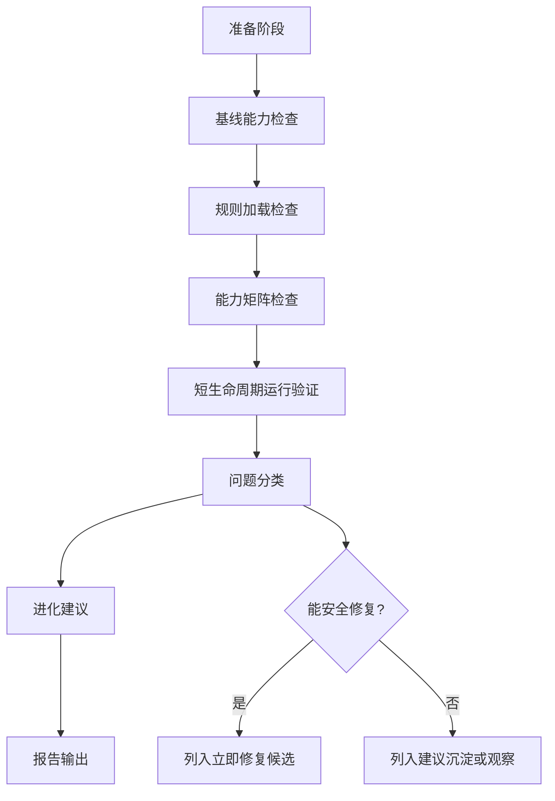

# Hermes 能力检查与进化闭环设计

## 背景

本次目标是检查本机 Hermes 能力是否可用，并找出能沉淀成长期改进的问题。检查结果不能只停在“命令能不能跑”，还要回答三个问题：

- 哪些能力已经正常工作？
- 哪些能力有问题或存在配置风险？
- 哪些问题可以通过安装或启用 skill、调整个人规则、修改 Hermes 本机配置、补自动化检查脚本来解决？

检查采用“受控全面检查”。它覆盖 Hermes 的主要能力面，但避免更新、迁移、卸载、真实平台发消息、读取敏感配置原文和长期后台运行。

## 范围

纳入范围：

- Hermes 安装路径、版本、运行入口和基础依赖。
- `doctor`、`status`、`dump`、`logs` 等诊断入口的可用性。
- `$HERMES_HOME/SOUL.md`、`$HERMES_HOME/AGENTS.md` 和 `rules/*.md` 的规则加载链路。
- skills、tools、plugins、MCP、cron、gateway、dashboard 的发现能力和短生命周期可启动性。
- 可沉淀问题的分类和落点建议。

排除范围：

- 不执行 `hermes update`、迁移、卸载、备份恢复或安装类写入动作。
- 不读取 `.env`、`config.yaml` 原文、sessions、memories、token、cookie 或日志全文。
- 不真实发送 Telegram、Discord、Slack、WhatsApp、Signal、Email 或其他外部平台消息。
- 不长期启动 gateway、dashboard、MCP server 或 cron worker。
- 不把临时日志、响应、截图或诊断缓存写入 Hermes 仓库提交范围。

## 检查流程

流程说明：

- 准备阶段先确认工作区状态，避免覆盖用户已有改动。
- 基线能力检查只运行只读命令和帮助命令。
- 规则加载检查只读取规则入口和软链接状态，不展开敏感配置。
- 能力矩阵检查汇总 commands、skills、tools、plugins、MCP、cron、gateway、dashboard。
- 短生命周期运行验证只验证本地组件能启动并退出，不留下长期进程。
- 问题分类后再决定是否进入修复或沉淀建议。

## 能力矩阵

| 检查域 | 主要问题 | 验证方式 | 输出 |
| --- | --- | --- | --- |
| 安装与版本 | 是否安装、路径是否一致、版本是否落后 | `which`、`hermes --version`、入口脚本信息 | 版本、路径、更新提示 |
| 基础诊断 | doctor/status 是否能运行 | `hermes doctor`、`hermes status`、必要时用 help 兜底 | 失败点和依赖缺口 |
| 规则加载 | SOUL/AGENTS/rules 链路是否断开 | 读取公开入口、检查软链接和文件存在性 | 规则链路结论 |
| Skills | 自定义 skill 是否被发现、是否冲突 | `hermes skills` 相关只读命令或 help | skill 清单和风险 |
| Tools | 工具集是否可见、配置是否异常 | `hermes tools` 相关只读命令或 help | 工具可用性摘要 |
| MCP | MCP server/client 配置是否可发现 | `hermes mcp` 相关只读命令或短启动 | MCP 能力状态 |
| Cron | 定时任务是否可列出 | `hermes cron` 只读子命令 | 任务数量和风险 |
| Gateway | 平台配置是否可检查 | `hermes gateway` 只读子命令 | 平台配置状态 |
| Dashboard | Web UI 是否能短启动 | 指定本地端口短启动并关闭 | 启动结果和端口占用 |

## 问题分类

每个发现项使用同一套分类，方便后续反复执行时比较变化。

| 分类 | 含义 | 处理方式 |
| --- | --- | --- |
| 立即修复 | 本机无敏感风险、改动范围小、收益明确 | 提出修复项，执行前再确认 |
| 建议沉淀 | 可通过规则、skill 或脚本提升以后表现 | 指明落点和建议内容 |
| 观察项 | 当前不影响使用，但可能变成问题 | 记录证据和触发条件 |
| 跳过项 | 涉及外部平台、敏感配置或写入风险 | 说明跳过原因和可选验证方式 |

进化落点：

- 个人规则：写入 `rules/*.md`，只沉淀可复用行为约束。
- Hermes 本机配置：只给本机操作建议，不在报告中暴露配置原文。
- 自定义 skill：当某类检查会重复出现，建议新增或调整个人维护的 skill。
- 自动化检查脚本：当步骤稳定、可只读执行、输出可脱敏时，建议写脚本复用。

## 子 Agent 使用

本次设计允许使用子 agent 做只读并行审计，但不把修改权限交给子 agent。适合拆成三条支线：

- 规则链路审计：检查 SOUL、AGENTS、rules 软链接和规则覆盖关系。
- Hermes 命令面审计：检查 CLI 子命令、help、version、doctor/status 输出摘要。
- 能力矩阵审计：检查 skills、tools、plugins、MCP、cron、gateway、dashboard 的只读状态。

主线程负责整合结论、控制副作用、判断哪些问题能沉淀。若进入真正修复阶段，需要先写实施计划，再按 `subagent-driven-development` 的流程执行任务和复核。

## 输出格式

最终报告包含五部分：

1. 摘要：当前 Hermes 是否可用于日常任务。
2. 能力矩阵：每个能力域的状态、证据和风险。
3. 问题清单：按严重程度和分类排列。
4. 进化建议：对应 skill、规则、配置或脚本的落点。
5. 未覆盖项：哪些验证因为安全、隐私或副作用边界被跳过。

报告中的命令输出只摘录关键行。涉及路径时可写本机路径；涉及 token、cookie、账号、连接串、内网地址、会话和日志细节时必须脱敏或不展示。

## 验收标准

- 检查覆盖安装、诊断、规则加载、skills、tools、MCP、cron、gateway、dashboard。
- 没有执行更新、迁移、卸载、真实外部平台投递或长期后台运行。
- 没有读取或输出敏感配置原文。
- 每个问题都有分类、证据、影响和下一步建议。
- 至少识别一类可沉淀的进化机会；如果没有，则明确说明没有发现可沉淀项。
- 报告能支持下一步写实施计划。
