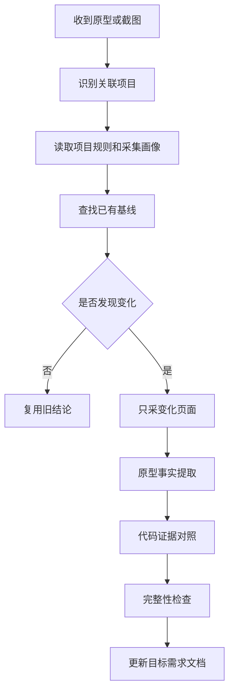

# 需求采集增量化设计

## 目标

把 `requirements-organizer` 从“根据原型整理需求”升级为“按项目习惯增量采集需求”。它要支持蓝湖这类只有链接和账号权限的原型，也要能结合关联项目代码、旧需求文档和项目规则做对照。

这次设计不追求全自动采集系统。第一版只改规则和流程，避免每次采集都产生一堆中间文件，也避免每次从零重跑相同探索。

## 非目标

- 不默认全量扫描整份原型
- 不默认生成采集报告、OCR 原文、截图清单或临时 JSON
- 不把项目习惯写进个人配置
- 不把代码反推内容伪装成原型明确需求
- 不为蓝湖专门写自动化脚本

## 设计原则

默认只输出用户要的需求文档变更。只有以下情况才保留额外产物：

- 原型页面确实发生变化，需要保存增量基线
- 连线、节点或状态有低置信判断，需要留待确认项
- 用户明确要求输出采集报告
- 项目规则要求保留一次正式采集记录

重复采集时，先复用项目内已有基线和采集画像。确认无变化时，不深采、不改文档，只说明没有发现需要更新的内容。

## 防过度设计约束

第一版只做“轻量状态 + 增量判断 + 目标文档补丁”。不引入独立数据库、任务队列、后台服务或大而全的采集平台。

默认产物最多包括：

- 目标需求文档的增量修改
- 必要时更新一条轻量基线摘要
- 材料不足时列出少量待确认项

如果同一原型、同一项目、同一页面的摘要哈希和关键节点关系没有变化，直接复用上次结论，不重新做 OCR、截图枚举、代码全仓扫描或完整报告。

## 项目级采集画像

每个项目可以维护自己的采集习惯。建议位置：

```text
.docs/requirements-collection/profile.md
```

画像只记录可共享信息，例如：

- 需求文档目录
- 常见模块和文档映射
- 常见代码锚点
- 原型平台和页面命名习惯
- 需求输出偏好
- 已知容易误判的流程或术语

画像不记录账号、cookie、临时截图、本机路径或私有登录态。

## 增量基线

项目可以保存原型基线。建议位置：

```text
.docs/requirements-collection/baselines/
```

基线只保留摘要，不保留大体积截图和临时 OCR 结果。字段控制在够判断变化即可：

```json
{
  "prototype": "AI助教小程序",
  "source": "lanhu",
  "pages": [
    {
      "path": "作业/换题",
      "textHash": "hash",
      "visualHash": "hash",
      "nodeCount": 18,
      "edgeCount": 24,
      "relatedDocs": [".docs/布置作业需求.md"],
      "relatedCode": ["PaperChangeItemTaskController"]
    }
  ]
}
```

如果当前任务只要求快速分析一张截图，不创建基线。

## 采集流程



## 原型事实提取

对普通页面，提取页面入口、按钮、表单、弹窗、状态、空态和异常态。

对流程图或杂乱节点图，先提取节点和连线，再写自然语言需求：

- 节点：名称、形状、颜色、位置、业务含义
- 连线：起点、终点、方向、标签、颜色、置信度
- 状态：默认态、展开态、收起态、弹窗态、处理中、成功、失败

低置信连线不写成确定需求，进入待确认项。

## 代码证据对照

如果用户说明原型关联某个项目，必须结合项目代码和旧文档。代码证据用于补齐关联，不替代原型事实。

输出时固定区分：

- `[明确][原型]`
- `[明确][代码现状]`
- `[推断][代码关联]`
- `[冲突]`
- `[待确认]`

如果代码已有接口、DTO、状态枚举或后台任务，应写清楚它和原型动作的关系。如果原型没有对应页面或交互，代码内容只写为现状，不反推成原型需求。

## 完整性检查

写入需求前做最小覆盖检查：

- 页面上的主要节点是否都被解释
- 可见连线是否有起点、终点、方向或待确认说明
- 按钮是否有触发动作和结果
- 弹窗是否有打开、关闭、提交、取消规则
- 状态色是否有图例或解释
- 旧文档、原型、代码之间的冲突是否单列

检查失败时，优先补采缺口；如果材料不足，直接写入待确认项，不扩写猜测。

## 输出策略

优先更新既有模块文档。只有新模块没有合适文档时才新建。

默认不输出额外报告。需要额外报告时，建议位置：

```text
.docs/requirements-collection/reports/
```

报告只保存差异、低置信项和人工确认事项，不保存重复正文。

## AI助教项目示例

`teacher-ai` 这类项目可以在自己的项目画像里记录：

- 需求文档目录是 `.docs`
- 常见模块包括布置作业、协同命题、自主命题、换题、知识库、AI 对话
- 常见代码锚点包括 Controller、Services.Dtos、Models、AgentFrontendContract
- 默认优先更新既有模块文档
- 原型和代码冲突时拆成原型期望、代码现状、待确认项

这些规则属于项目协作习惯，不写入个人全局配置。

## 验收标准

- 相同原型没有变化时，不重复深采，不改需求文档
- 有变化时，只采变化页面和相关代码锚点
- 复杂流程图输出节点和连线解释，低置信项进入待确认
- 关联项目时，需求文档能看出原型事实和代码现状的差异
- 默认不产生无用中间文件
