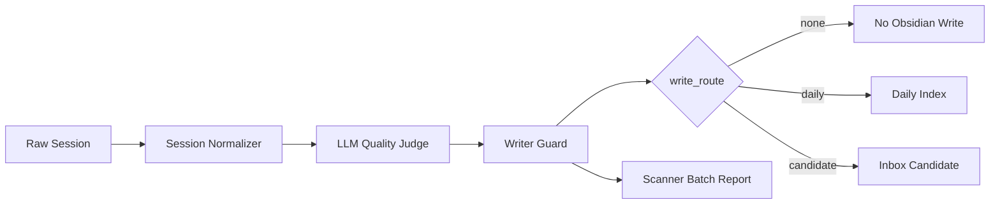
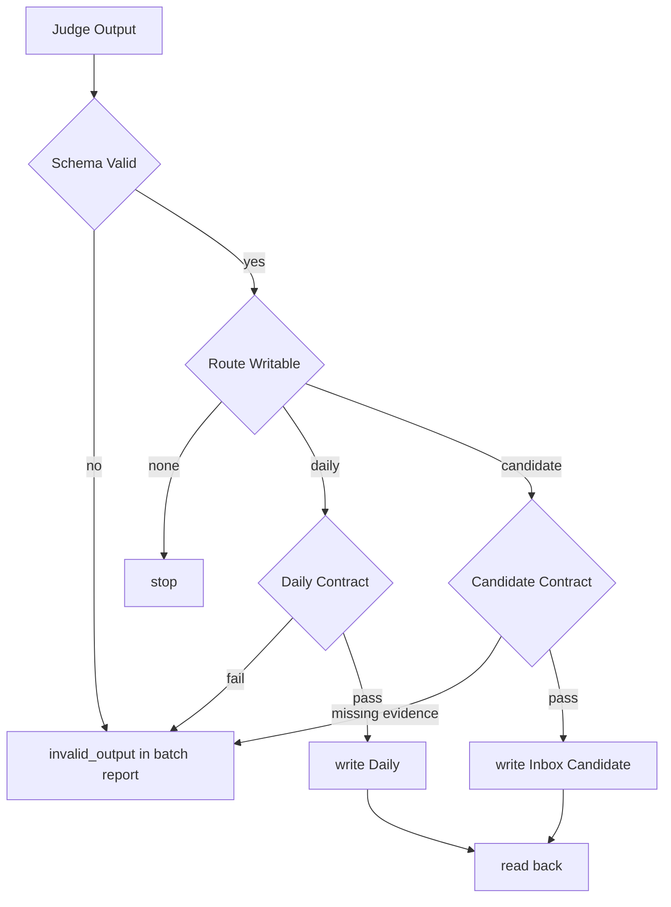

# Personal Knowledge LLM Quality Judge Design

## 背景

当前个人知识库扫描器会从 CLI 会话生成 Obsidian Daily 或 Inbox 候选。已有问题是：总结器容易把低价值过程包装成像知识的条目，事后质量检查又只能检查已经生成的文本，无法阻止污染进入写入链路。

本设计只解决个人 Obsidian 知识库的写入前质量裁判，不建设 LLMOps 平台，不做通用内容治理系统。

## 目标

- 在写入 Obsidian 前，由 LLM 判断会话是否值得写入。
- 生产代码不硬编码内容价值规则。
- 保证可写入内容能追溯到原始会话证据。
- 保持第一期足够小，适合个人知识库维护成本。

## 非目标

第一期明确不做：

- LangSmith、Langfuse、Braintrust 等外部 eval 平台。
- Dashboard、多模型投票、向量库去重。
- Obsidian Review 目录、人工标注队列。
- 自动 promote 到 rules 或 skill。
- 多次 LLM 审稿链。
- 内容排除清单、关键词规则、会话类型规则。

## 核心原则

生产代码零内容价值硬规则：

- 不按关键词判断质量。
- 不按文本长度判断质量。
- 不按来源前缀判断质量。
- 不按会话类型判断质量。
- 不按路径、工具名或固定场景判断质量。
- 不按 golden case 相似度判断质量。

内容语义交给 LLM。代码只守结构、证据、安全和写入契约。

## 总体流程



生产链路只保留三段：

1. Session Normalizer
2. LLM Quality Judge
3. Writer Guard

## Session Normalizer

Normalizer 只做结构化和证据编号，保留原始内容。

它可以输出：

- `turn_id`
- `role`
- `content`
- `tool_event_id`
- `timestamp`
- `source`
- `session_id`

它不能做：

- 丢弃内容。
- 筛选内容。
- 判断内容价值。
- 根据内容改写 route。

Normalizer 的价值是让后续 LLM 和 Writer Guard 能引用同一组证据编号。

## LLM Quality Judge

LLM Quality Judge 是唯一内容价值裁判。生产只调用一次 LLM。

Prompt 内部要求它完成三步：

1. 提出可能沉淀的 claims。
2. 对 claims 做自我反驳。
3. 给出最终写入目标。

写入目标字段为 `write_route`：

- `none`：不写 Obsidian。
- `daily`：写 Daily 极短时间线索引。
- `candidate`：写 Inbox 长期候选。

没有 Obsidian `review` 路由。

### 不确定状态

LLM 不确定时输出：

```json
{
  "write_route": "none",
  "none_reason": "uncertain",
  "manual_review": true
}
```

`manual_review=true` 只进入 scanner batch report，不写 Obsidian，不形成审核队列。

`none_reason` 只在 `write_route=none` 时由 Judge 填写，可取值：

- `low_value`
- `uncertain`
- `unsafe`

`invalid_output` 由解析层或 Writer Guard 报告，不要求 Judge 自己产出。

### 输出结构

```json
{
  "write_route": "none | daily | candidate",
  "none_reason": "low_value | uncertain | unsafe",
  "manual_review": false,
  "confidence": "low | medium | high",
  "claims": [
    {
      "claim": "可写入的语义结论",
      "evidence_refs": ["turn_3"],
      "reason": "为什么未来可复用或可追溯"
    }
  ],
  "counterarguments": [],
  "reasoning_summary": "简短判断理由"
}
```

输出预算：

- `none`：允许 `claims=[]`，只保留短 `reasoning_summary`。
- `daily`：最多 1 条 claim。
- `candidate`：最多 3 条 claims，每条必须有 `evidence_refs`。
- `counterarguments`：最多 2 条，只在 `candidate` 或 `manual_review=true` 时需要。

## Writer Guard

Writer Guard 不判断内容好坏，只判断是否可安全落盘。

检查项：

- JSON schema 合法。
- 必填字段存在。
- `candidate` 的每条 claim 有 `evidence_refs`。
- frontmatter 合法。
- 写入路径合法。
- 敏感凭据值不直接写入。
- 写入后能读回。

Guard 失败的含义是不可写或进入 batch report。它不能把 Guard 失败改判成 `low_value`。



## Daily 与 Candidate

Daily 只保留未来可追溯的极短时间线索引，不做完整流水账。不能用会话类型决定 Daily。

Candidate 才是长期知识候选。Candidate 的正文必须只来自 Judge 批准的 claims，不允许总结器扩展新结论。

## Golden Cases

保留 10-30 个 golden cases，只用于离线回归：

- prompt 变更前后。
- 模型变更前后。
- 流程变更前后。

Golden cases 不参与生产匹配，不能变成规则、正则、黑名单、白名单或相似度判断。

## Batch Report

Scanner batch report 只记录运行状态和异常边界，不是审核队列。

可记录：

- route 分布。
- `manual_review=true` 的 session id 和原因。
- `invalid_output`。
- Guard 失败原因。
- 写入成功和失败数量。

Batch report 不进入 Obsidian 候选区。

## Prompt 约束

Judge prompt 应使用判断维度，不使用场景清单。

推荐约束：

```text
只根据编号证据判断。不要根据关键词、文本长度、来源、会话类型、路径、工具名或固定场景推断价值。
先提出可能沉淀的 claims。每个 claim 必须能被证据编号支持，并说明它将来会改变什么理解、决策或操作。
对每个 claim 给出最强反驳：是否缺少可复用结论、是否证据不足、是否需要人工确认。
最后只选择一个写入目标：none、daily、candidate。
输出理由必须引用证据编号，不得引用场景类型作为理由。
```

应避免：

- 如果是某类主题就写入。
- 如果是某类短语就不写。
- 来自某个 CLI 的内容优先或降级。
- 命中 golden case 相似模式则写入。

## 测试计划

第一期测试只覆盖最小质量门：

- Normalizer 保留内容并生成稳定证据编号。
- Judge 输出能被 schema 校验。
- `candidate` 缺 `evidence_refs` 时不写入，只进入 batch report。
- `manual_review=true` 不写 Obsidian。
- Writer Guard 不按内容改判 route。
- Golden cases 只在离线回归入口使用，不被生产路径引用。
- Daily 写入保持极短索引，不生成完整流水账。

## 定稿结论

现有扫描器只需要增加一道本地 LLM 审稿门。LLM 负责语义裁决，代码负责证据和写入契约；默认少写，不确定只进批次报告，不进 Obsidian。
