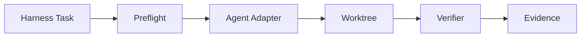

# Harness 多 Agent Smoke 设计

日期：2026-05-21

## 目标

先在个人 GitHub 测试仓库里跑通最小任务，证明本地 AI Harness 能分别调用 Codex、Claude Code、Hermes 和 OpenClaw，并产出同一类证据：`result.json`、stdout、stderr、最终输出和 `diff.patch`。

公司业务仓库不参与测试，不读写，不作为 smoke 环境。

最小任务只做一件事：让每个 agent 在 harness 管理的 worktree 里写一个文件，例如 `runs/codex.txt`。Verifier 只检查文件存在、内容正确、diff 范围正确。



## 不做什么

- 不碰公司业务仓库。
- 不做 ACP、MCP 或自定义协议。
- 不做统一事件模型。
- 不做复杂任务编排。
- 不在运行中自动升级 Codex、Claude、Hermes 或 OpenClaw。
- 不让 OpenClaw 在 Gateway 失败时偷偷 fallback 后假装通过。

## 最小改动

只给 `agent_config.json` 增加一个字段：

```json
{
  "agent": "codex"
}
```

默认仍是 `codex`，避免破坏现有 harness 行为。生成的 `execute.py` 根据这个字段选择一个很薄的 adapter。Adapter 只负责拼命令、执行 CLI、保存 stdout/stderr/final 输出，并写 `agent.result.json`。

## Adapter 命令

| Agent | 默认命令形态 | 保留输出 |
| --- | --- | --- |
| Codex | `codex exec --cd "$WORKSPACE" --sandbox workspace-write --json --output-last-message "$FINAL" "$PROMPT"` | JSONL stdout、stderr、final message |
| Claude | `claude -p --output-format json --permission-mode dontAsk --no-session-persistence "$PROMPT"` | JSON stdout、stderr |
| Hermes | `hermes -z "$PROMPT"` | final stdout、stderr |
| OpenClaw | `openclaw agent --agent "$AGENT_ID" --session-id "$RUN_ID" --message "$PROMPT" --json --timeout "$TIMEOUT"` | JSON stdout、stderr |

## Preflight

每次真正执行前只检查必要项：

- CLI 是否在 `PATH`；
- 版本是否能读到；
- 必要配置是否存在，比如 `openclaw.agent_id`；
- OpenClaw 使用 Gateway 模式时，先显式 probe Gateway。

Preflight 失败时，写 `preflight_failed` 到 `agent.result.json`，并在修改 worktree 之前停止。

## Smoke 仓库

使用个人测试仓库，例如 `harness-agent-smoke`。仓库只需要：

- 一个已提交的初始文件；
- 一个 harness task，要求当前 agent 写 `runs/$AGENT.txt`；
- 一个 verifier，检查文件内容和 diff 范围。

四个 agent 可以用四个 task，也可以用同一个 task 加不同 run config。第一阶段优先选简单、可读、容易排错的做法。

## 验收标准

```text
codex:    passed，diff.patch 非空，runs/codex.txt 内容正确
claude:   passed，diff.patch 非空，runs/claude.txt 内容正确
hermes:   passed，diff.patch 非空，runs/hermes.txt 内容正确
openclaw: passed，或明确 preflight_failed 且没有修改 worktree
```

OpenClaw 默认走 Gateway。只有配置明确写 `mode=local` 时，才允许 embedded local 模式。

## 版本事实

这些信息在 2026-05-21 核对：

- Codex 本地版本：`0.130.0`；观察到的最新稳定 GitHub release：`0.132.0`。
- Claude 本地版本：`2.1.145`；观察到的最新 GitHub release：`2.1.145`。
- Hermes 本地版本：`0.13.0`；观察到的最新 GitHub release：`0.14.0`。
- OpenClaw 本地版本：`2026.5.7`；观察到的最新 GitHub release：`2026.5.19`。

Smoke 可以先从当前本地版本开始，但运行证据必须记录版本。Hermes 或 OpenClaw 如果因为版本差异失败，不在本设计里自动升级，只把失败原因写清楚。

## 资料来源

- OpenAI Codex non-interactive mode: <https://developers.openai.com/codex/noninteractive>
- OpenAI Codex CLI reference: <https://developers.openai.com/codex/cli/reference>
- Claude Code CLI usage: <https://code.claude.com/docs/en/cli-usage>
- Claude Code permission modes: <https://code.claude.com/docs/en/permission-modes>
- Hermes CLI commands: <https://hermes-agent.nousresearch.com/docs/reference/cli-commands>
- OpenClaw agent CLI: <https://docs.openclaw.ai/cli/agent>
- OpenClaw Gateway CLI: <https://docs.openclaw.ai/cli/gateway>
