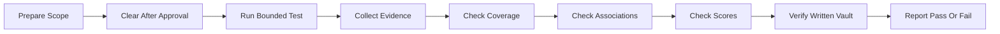
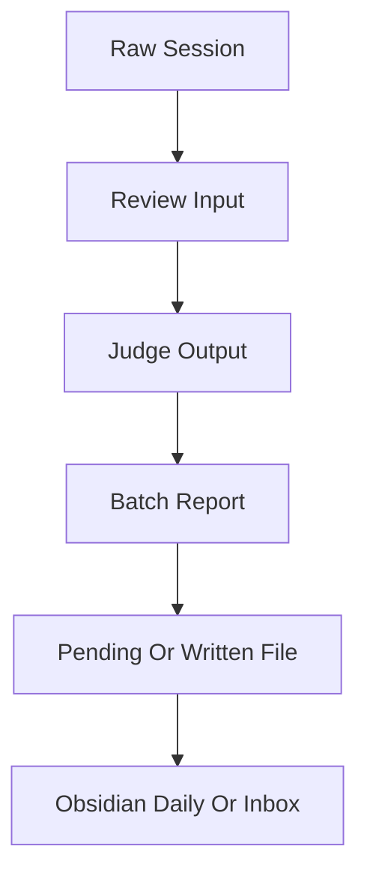

# Obsidian 质量固定测试流程

## 背景

本设计用于反复验证 Codex、Claude、Hermes、OpenClaw 会话进入 Obsidian 个人知识库的质量。目标是先测试、先取证、先给用户确认，而不是在没有证明失败前修改被测对象。

这是一套固定测试流程，不是新的运行架构。每次执行前只按本文准备测试范围和验收口径，不重新设计流程。

## 目标

- 覆盖 Codex、Claude、Hermes、OpenClaw 的会话采集、筛选、关联、评分和 Obsidian 写入结果。
- 防止漏掉真实协作会话。
- 确认质量分数来自可观察证据，而不是模型自称的置信度。
- 确认 Daily、Inbox、批次报告等日志格式稳定且可追溯。
- 确认主会话、子 agent 会话和相关会话能被正确关联。
- 确认用户强烈纠偏、反复强调、明确要求重视的问题必须被记录并突出。

## 非目标

- 不建设新的测试平台。
- 不把测试流程做成新的系统或工具。
- 不新增内容价值硬规则、关键词规则或场景白名单。
- 不在未复现失败前修改扫描器、质量裁判、写入器或规则仓库。
- 不用一次本地单测替代 Obsidian 实际写入结果检查。

## 总体流程

每次测试都按上图顺序执行。任何一步出现未闭环证据，都不能跳到“通过”结论。

## 范围边界

测试必须有明确日期边界。用 `--since` 只表示下限，不能替代日期范围；跨天测试必须显式指定日期集合，例如只验证 `2026-05-20` 时使用 `--dates 2026-05-20`。

当前仍在增长的当天会话不能和历史稳定日混跑。若要测试当天日志，要么先排除活跃会话，要么等待稳定窗口；否则结果只能标为未闭环，不能给通过结论。

## 执行前确认

测试前必须先列出本轮会影响的对象，再由用户确认是否继续：

- 本轮测试日期。
- 参与来源：Codex、Claude、Hermes、OpenClaw。
- 将清空或覆盖的今日 Daily、Inbox、批次报告、临时工作目录。
- 是否会触发 Obsidian 写入。
- 是否仅做无写入取证。

清空今日日志属于写入或删除动作。执行者必须先展示路径清单和影响范围，用户确认后才能清空，避免旧数据污染本轮检查。

## 取证链路

每个会话必须能沿下面链路追踪：

验收时按 `source + session_id` 或等价稳定标识核对。任一真实会话在链路中丢失、重复、串源或无法回查，都视为失败。

## 覆盖检查

覆盖检查不判断内容好坏，只判断有没有漏数据：

- 四个来源的原始会话数量必须有统计。
- 进入 review input 的会话数量必须有统计。
- 被排除的会话必须有原因，且原因能回到排除规则或低价值判断证据。
- 每个进入质量裁判的会话必须有对应 judge 输出。
- 每个写入或跳过决定必须出现在批次报告里。
- Obsidian 中最终出现的 Daily 或 Inbox 条目必须能反查来源会话。

对 `api-*`、断连、无 assistant 回复、一次性错误等已定义排除项，可以不写 Daily，但必须在批次自检统计里体现排除数量。

## 关联检查

如果会话之间存在连续纠偏、同一问题反复出现、同一测试流程上下文、同一 Obsidian 质量问题、主会话和子 agent 关系，测试必须确认它们被关联，而不是当作彼此无关的孤立条目。

关联结果至少要回答：

- 哪些会话属于同一条问题链。
- 哪个是主会话，哪个是子 agent 或后续延伸会话。
- 用户指出的问题是什么。
- agent 做错或没做到位的行为是什么。
- 这条关联对日志重要性、候选条目或后续规则沉淀有什么影响。

无法自动判断关联时，不能伪造关联；应在报告中列为“需要人工确认的关联缺口”。

## 强纠偏记录

用户表达强烈不满、反复强调同一问题、明确要求重视、指出 agent 没听懂、指出硬编码或越权修改时，测试期望不是“只进入候选等待以后再说”，而是必须在本轮日志中突出记录。

记录内容至少包括：

- 用户明确指出的问题。
- 相关会话链。
- agent 当时的错误动作或错误判断。
- 以后执行同类任务时必须遵守的边界。
- 是否需要生成规则候选、skill 候选或仅作为本次复盘日志。

这类记录仍然需要证据引用，不能靠情绪词本身做内容判断，也不能把用户原话大段复制进知识库。

## 质量评分

质量分只来自可检查事实，不来自模型自称的 `confidence`。

每个评分项都必须给出证据：

- 覆盖完整性：来源会话是否全量进入取证链路。
- 证据充分性：候选或 Daily 条目是否能指向原始会话证据。
- 路由一致性：写入、跳过、人工确认状态是否和质量裁判输出一致。
- 格式合规性：frontmatter、字段、路径、正文结构是否符合 Obsidian 约定。
- 关联准确性：相关会话、主子 agent、连续纠偏是否被正确串联。
- 强纠偏处理：用户明确指出的重要问题是否被突出记录。
- 写入安全性：无未确认清空、无越权写入、无凭据明文进入日志。

评分报告必须同时给出扣分证据和不可判定项。没有证据时不能给满分，也不能把“未发现问题”写成“已证明没有问题”。

## 日志格式检查

Daily 只做短索引，不写完整会话复述。Inbox 候选才承载长期知识条目。

检查项：

- Daily 条目短、可追溯、不过度总结。
- Inbox 候选有合法 frontmatter。
- `source`、`session_id`、`contexts`、`status`、`agent_load` 等字段符合约定。
- 不出现废弃字段、临时调试字段或仅测试用字段。
- 批次报告包含数量、排除、写入、失败、人工确认和格式校验结果。
- Obsidian 文件名和标题来自语义摘要，不直接截取首轮短消息或自动标题。

## 写入后实态验证

写入 Obsidian 后必须检查真实 vault 文件，而不是只相信写入命令返回值。

至少检查：

- 本轮 ready 的 `source_key` 是否都能在 Daily 或 Inbox 中找到最终位置。
- 同一日期、同一 `source + session_id` 的 Inbox 候选最多只能有 1 个。
- 候选从 Daily 移出后，Daily 里不能残留该候选会话 marker。
- stale 候选文件必须被删除，不能因为 REST API 目录列不出文件就跳过清理。
- 写入器必须在发现重复候选时失败，不能把“让用户手动看”当作质量门禁。

## 验收门槛

一次测试只有同时满足以下条件，才能报告通过：

- 用户确认过测试前清空范围，或本轮明确只读且未清空。
- 四个来源的会话数量、排除数量、进入质量裁判数量、写入数量能对上。
- 没有真实协作会话在链路中丢失。
- 主会话、子 agent 和相关会话的关联关系有证据。
- 用户强纠偏内容被记录并突出。
- 质量分数每一项都有证据或明确标为不可判定。
- Obsidian Daily、Inbox 和批次报告格式检查通过。
- 写入后的真实 vault 检查通过，不存在重复候选、残留旧文件或无法反查来源的问题。

## 失败处理

发现问题时先报告证据，不直接改代码。

报告必须区分：

- 已复现失败。
- 尚未证明的怀疑。
- 流程设计缺口。
- 需要用户确认的写入或清空动作。
- 需要后续授权才可修改的被测对象。

只有用户明确授权修复后，才进入代码修改或规则修改。

## 固定输出

每次测试结束输出同一结构：

1. 测试范围：日期、来源、是否清空、是否写入 Obsidian。
2. 覆盖统计：原始、排除、进入质量裁判、写入、跳过、失败。
3. 会话链路：每个来源的关键 `session_id` 和最终位置。
4. 关联结果：相关会话、主子 agent、连续纠偏链。
5. 强纠偏记录：用户明确指出的重要问题及处理结果。
6. 质量评分：每项分数、证据、扣分原因、不可判定项。
7. Obsidian 检查清单：自动验证到的 Daily、Inbox、报告路径和异常项。
8. 结论：通过、失败或证据不足。

其中第 7 项是自动检查结果清单，不是让用户代替系统判断。若某项必须靠用户肉眼判断才能给结论，本轮结论应写“证据不足”或“失败”，并说明缺少哪类自动证据。

## 后续使用方式

后续用户要求“做 Obsidian + 质量把控全方位测试”时，执行者应先找到本文件，再按本文列范围、清空确认、取证、检查和报告。未完成取证前，不得修改被测代码或规则。
