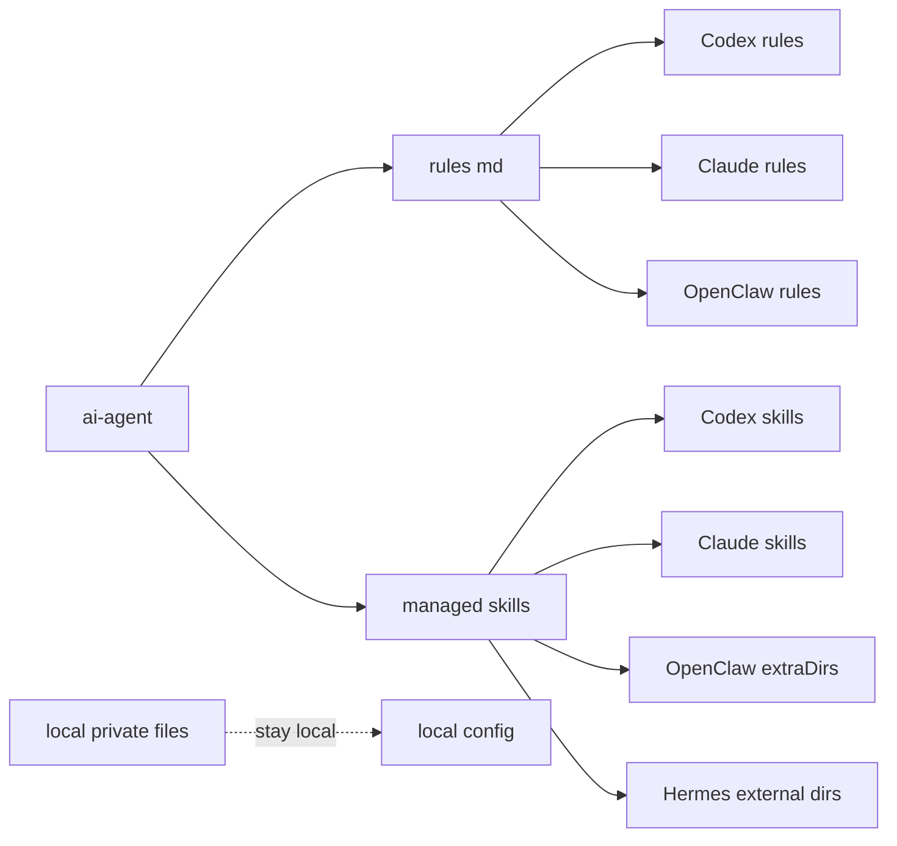

# 规则与 Skill 软链接设计

本文说明 `ai-agent` 如何成为本机各 Agent 的规则和自定义 skill 唯一来源。目标是让 Codex、Claude、OpenClaw、Hermes 使用同一套公共规则和自定义技能，同时避免同步凭据、缓存、会话和本机审批历史。

## 目标

- `ai-agent/rules/*.md` 是公共规则唯一来源。
- `ai-agent/skills/<skill-name>/` 是共享托管 skill 的唯一来源。
- Codex 修改 `~/.codex/rules/*.md` 时，实际修改 `ai-agent/rules/*.md`。
- 只软链接明确托管的文件或 skill；不软链接整个工具目录。
- `default.rules`、本机 local 配置、缓存、会话、日志和凭据保持本机私有。

## 仓库边界



`ai-agent` 保存规则、入口模板、同步说明和自定义 skill 的公共逻辑、脚本、参考资料和示例配置。任何真实地址、账号、密码、token、cookie、浏览器会话、内部项目路径和运行缓存都不能进入这个仓库。

## 规则映射

规则使用逐文件软链接，不链接整个 `rules/` 目录。原因是 Codex 的 `default.rules` 是本机命令审批历史，必须留在本机。

| 本机生效位置 | 来源 | 处理方式 |
| --- | --- | --- |
| `~/.codex/rules/*.md` | `ai-agent/rules/*.md` | 逐文件软链接 |
| `~/.codex/rules/default.rules` | 本机生成 | 普通文件，不同步 |
| `~/.claude/rules/*.md` | `ai-agent/rules/*.md` | 逐文件软链接，由 `~/.claude/CLAUDE.md` 引用 |
| `~/.openclaw/workspace/rules/*.md` | `ai-agent/rules/*.md` | 逐文件软链接，由 `~/.openclaw/workspace/AGENTS.md` 要求按任务读取 |
| `~/.hermes/rules/*.md` | `ai-agent/rules/*.md` | 逐文件软链接，由 `~/.hermes/SOUL.md` 要求按任务读取 |
| `~/.hermes/profiles/<profile>/rules/*.md` | `ai-agent/rules/*.md` | 逐文件软链接，由 profile `SOUL.md` 要求按任务读取 |

Codex 侧的目标状态：

```text
~/.codex/rules/coding-rules.md -> <ai-agent>/rules/coding-rules.md
~/.codex/rules/communication-rules.md -> <ai-agent>/rules/communication-rules.md
~/.codex/rules/markdown-rules.md -> <ai-agent>/rules/markdown-rules.md
~/.codex/rules/mcp-output-rules.md -> <ai-agent>/rules/mcp-output-rules.md
~/.codex/rules/openclaw-rules.md -> <ai-agent>/rules/openclaw-rules.md
~/.codex/rules/project-governance.md -> <ai-agent>/rules/project-governance.md
~/.codex/rules/requirements-and-prototype.md -> <ai-agent>/rules/requirements-and-prototype.md
~/.codex/rules/security-and-privacy-rules.md -> <ai-agent>/rules/security-and-privacy-rules.md
~/.codex/rules/skill-rules.md -> <ai-agent>/rules/skill-rules.md
~/.codex/rules/testing-rules.md -> <ai-agent>/rules/testing-rules.md
~/.codex/rules/default.rules stays local
```

## Skill 映射

Skill 也只链接明确托管的目录，不链接整个 `~/.codex/skills`。Codex 的 skill 目录里混有系统 skill、插件 skill、缓存和本机安装态，整体纳入 Git 会污染公共仓库。

Skill 默认不自动启用。不同成员所在公司、项目和工具链不同，`bug`、`grafana`、`publish-gitlab-argo`、`hg-git` 等 skill 可能依赖各自的本机配置或仓库权限。新机器先接入公共规则，再按需选择 skill。

当前托管这些 skill：

- `bug`
- `grafana`
- `hg-git`
- `multi-agent-workflow`
- `personal-knowledge`
- `publish-gitlab-argo`
- `requirements-organizer`
- `rule-fix`
- `tutorial-writer`

后续如果要把 `brainstorming`、`writing-plans`、`verification-before-completion` 等流程类 skill 也纳入共享托管，需要先检查来源和许可，再加入托管清单。

目标状态：

```text
~/.codex/skills/bug -> <ai-agent>/skills/bug
~/.codex/skills/publish-gitlab-argo -> <ai-agent>/skills/publish-gitlab-argo
~/.codex/skills/grafana -> <ai-agent>/skills/grafana
~/.codex/skills/hg-git -> <ai-agent>/skills/hg-git
~/.codex/skills/multi-agent-workflow -> <ai-agent>/skills/multi-agent-workflow
~/.codex/skills/personal-knowledge -> <ai-agent>/skills/personal-knowledge
~/.codex/skills/requirements-organizer -> <ai-agent>/skills/requirements-organizer
~/.codex/skills/rule-fix -> <ai-agent>/skills/rule-fix
~/.codex/skills/tutorial-writer -> <ai-agent>/skills/tutorial-writer

~/.claude/skills/bug -> <ai-agent>/skills/bug
~/.claude/skills/grafana -> <ai-agent>/skills/grafana
~/.claude/skills/hg-git -> <ai-agent>/skills/hg-git
~/.claude/skills/multi-agent-workflow -> <ai-agent>/skills/multi-agent-workflow
~/.claude/skills/personal-knowledge -> <ai-agent>/skills/personal-knowledge
~/.claude/skills/publish-gitlab-argo -> <ai-agent>/skills/publish-gitlab-argo
~/.claude/skills/requirements-organizer -> <ai-agent>/skills/requirements-organizer
~/.claude/skills/rule-fix -> <ai-agent>/skills/rule-fix
~/.claude/skills/tutorial-writer -> <ai-agent>/skills/tutorial-writer
~/.hermes/config.yaml skills.external_dirs includes each <ai-agent>/skills/<managed-skill>
~/.hermes/profiles/<profile>/config.yaml skills.external_dirs includes each <ai-agent>/skills/<managed-skill>
```

OpenClaw 不使用 `~/.openclaw/workspace/skills/<managed-skill>` 软链接。OpenClaw 会拒绝解析到 workspace 外部的 skill 软链接，并把它标记为 `symlink-escape`。OpenClaw 托管 skill 通过 `~/.openclaw/openclaw.json` 的 `skills.load.extraDirs` 逐个加入，并把 skill 名加入需要使用它的 agent allowlist。

OpenClaw 目标配置形态：

```json
{
  "skills": {
    "load": {
      "extraDirs": [
        "<ai-agent>/skills/bug",
        "<ai-agent>/skills/grafana",
        "<ai-agent>/skills/hg-git",
        "<ai-agent>/skills/multi-agent-workflow",
        "<ai-agent>/skills/personal-knowledge",
        "<ai-agent>/skills/publish-gitlab-argo",
        "<ai-agent>/skills/requirements-organizer",
        "<ai-agent>/skills/rule-fix",
        "<ai-agent>/skills/tutorial-writer"
      ]
    }
  }
}
```

## 安装流程

新机器 clone 仓库后，直接运行自动接入：

```bash
python3 scripts/setup_links.py
```

脚本会自动检测本机已有的 Codex、Claude、Hermes 和 OpenClaw，为检测到的工具链接共享 `AGENTS.md` 和逐文件 `rules/*.md`。已有入口或规则文件会先备份到对应工具目录下的 `.ai-agent-backups/`，再创建链接。

需要先看计划时：

```bash
python3 scripts/setup_links.py --print-only
```

接入后运行只读检查：

```bash
python3 scripts/doctor.py
```

脚本不会安装 agent CLI、不会写私有配置、不会默认启用所有 skill。`~/.claude/CLAUDE.md` 和 `$HERMES_HOME/SOUL.md` 如果已经存在且没有引用 `AGENTS.md`，脚本会先备份，再追加公共入口引用。

维护者仍可指定单个工具或选定 skill：

```bash
python3 scripts/setup_links.py --tool codex --rules --print-only
python3 scripts/setup_links.py --tool codex --skills multi-agent-workflow,personal-knowledge --print-only
```

1. 先把当前 Codex 中确认最新的公共规则同步到 `ai-agent/rules/*.md`。
2. 把当前 Codex 中确认最新的托管 skill 同步到 `ai-agent/skills/<skill-name>/`，排除 `.DS_Store`、`__pycache__`、日志、缓存和本机配置。
3. 做敏感扫描，至少覆盖 token、password、cookie、内网地址、真实 URL、个人绝对路径和会话文件。
4. 提交或确认 `ai-agent` 仓库的公共变更。
5. 为每个待链接文件或目录创建备份。
6. 删除本机旧副本，创建软链接。
7. 验证 `test -L`、`readlink`、`diff` 和相关 skill 的最小回归检查。

## 回滚策略

每次替换前都保留本机备份。若某个工具不识别软链接，回滚步骤是删除软链接，并把备份移动回原路径。回滚不影响 `ai-agent` 仓库内容。

## 不同步内容

- `~/.codex/rules/default.rules`
- `~/.codex/local/`
- `~/.claude/settings*.json`
- `~/.hermes/config.yaml`
- OpenClaw 设备身份、会话、日志、运行状态
- 任何真实凭据、cookie、token、浏览器会话、内部地址、测试账号和项目私有配置
- `.DS_Store`、`__pycache__`、日志、缓存和临时产物

## 验证标准

- 修改 `~/.codex/rules/<name>.md` 后，`git status` 能在 `ai-agent` 仓库看到对应变更。
- 修改 `~/.codex/skills/bug/SKILL.md` 后，`git status` 能在 `ai-agent` 仓库看到对应变更。
- `openclaw skills check` 中托管 skill 来源应显示为 `openclaw-extra`，不能出现 `symlink-escape`。
- `default.rules` 不出现在 `ai-agent` 的可提交变更里。
- skill 回归检查能在不打印真实凭据的前提下运行。
- 新机器只需要 clone `ai-agent` 仓库，执行只读检查，并按需链接公共规则和选定 skill。
