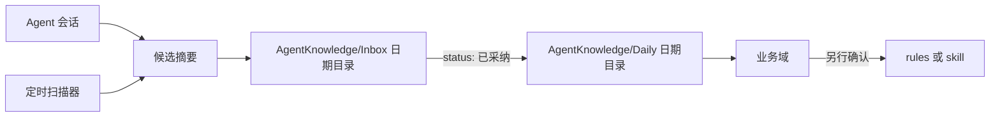

# Obsidian 结构说明

本文说明个人知识库的当前结构和维护边界。`SKILL.md` 仍是写入格式、候选 schema 和行为规则的权威来源；本文只解释 vault 怎么组织、哪些文件是入口、结构变更时要同步什么。

Vault 位于本机 Obsidian 目录，常见路径是 `~/Documents/Obsidian Vault`。不要把带用户名的绝对路径写进可同步文档。

## 总览图

```mermaid
flowchart TD
    vault[Obsidian Vault]
    config[.obsidian 本地配置]
    templates[Templates 模板目录]
    knowledge[AgentKnowledge 个人知识库主体]
    nonCore[非核心文件]
    welcome[欢迎.md 默认欢迎页]

    vault --> config
    vault --> templates
    vault --> knowledge
    vault --> nonCore
    nonCore --> welcome

    config --> dailyConfig[daily-notes 配置]
    config --> templateConfig[templates 配置]
    config --> restApi[local-rest-api 插件]

    templates --> candidateTemplate[Agent日志候选.md]
    templates --> dailyTemplate[Agent每日笔记.md]

    knowledge --> entry[00-入口.md 总入口]
    knowledge --> canvas[AgentKnowledge 工作台.canvas]
    knowledge --> base[候选处理.base]
    knowledge --> inbox[Inbox 候选日志]
    knowledge --> daily[Daily 已采纳日志]
    knowledge --> domains[五个业务域]

    inbox --> inboxGuide[候选池.md 候选导航]
    inbox --> inboxDate[YYYY-MM-DD 日期文件夹]
    inboxDate --> candidateLog[会话标题.md]
    daily --> dateDir[YYYY-MM-DD 日期文件夹]
    dateDir --> adoptedLog[会话标题.md]
    daily --> timeline[时间线.md 时间线枢纽]
    daily --> dailyReadme[README.md 目录说明]

    domains --> d1[01-Agent工作台]
    domains --> d2[02-研发实现]
    domains --> d3[03-排查与观测]
    domains --> d4[04-需求与文档]
    domains --> d5[05-交付与验证]

    d1 --> hub1[同名枢纽页 + README]
    d2 --> hub2[同名枢纽页 + README]
    d3 --> hub3[同名枢纽页 + README]
    d4 --> hub4[同名枢纽页 + README]
    d5 --> hub5[同名枢纽页 + README]
```

## 核心节点

- `AgentKnowledge/00-入口.md`：知识库总入口，连接时间线、候选池、五个业务域、Base 和 Canvas。
- `AgentKnowledge/Inbox/`：候选日志目录。候选按日期放入 `AgentKnowledge/Inbox/YYYY-MM-DD/<会话标题>.md`，frontmatter 的 `domain` 必须指向五个业务域之一。
- `AgentKnowledge/Inbox/候选池.md`：候选池导航和处理规则页，不是候选日志。
- `AgentKnowledge/候选处理.base`：候选处理视图，只展示 `AgentKnowledge/Inbox` 下的 Markdown 候选，并排除 `候选池.md`。
- `AgentKnowledge/Daily/`：已采纳日志目录。候选审核通过后进入 `AgentKnowledge/Daily/YYYY-MM-DD/<会话标题>.md`。
- `AgentKnowledge/Daily/时间线.md`：时间线枢纽。
- `AgentKnowledge/Daily/README.md`：Daily 目录说明页，核心导航仍是 `时间线.md`。
- `AgentKnowledge/AgentKnowledge 工作台.canvas`：人工处理和总览用 Canvas 工作台。
- `Templates/Agent日志候选.md`：候选日志模板。
- `Templates/Agent每日笔记.md`：Daily 已采纳日志模板。

## 业务域

正式确认的长期知识归入一个业务域。不要因为单次任务新增顶层域。

- `01-Agent工作台`：Codex、Claude、Hermes、OpenClaw、gstack、规则、skill、Obsidian 接入。
- `02-研发实现`：代码实现、重构、后端、前端、浏览器自动化和工程实践。
- `03-排查与观测`：bug、日志、Grafana、MCP 数据查询、链路追踪和根因判断。
- `04-需求与文档`：需求、原型、PRD、技术调研、方案文档和写作规范。
- `05-交付与验证`：测试、QA、发布、GitHub 同步、dev 发布和回归。

每个业务域目录包含同名枢纽页和 `README.md`。候选正文的归宿链接应指向同名枢纽页，例如 `[[01-Agent工作台/01-Agent工作台|01-Agent工作台]]`，不要指向 `README.md`。

## 写入流

- 扫描器只直接写入 `AgentKnowledge/Inbox/YYYY-MM-DD/<会话标题>.md`。
- 会话内写入可以使用 Obsidian MCP、Local REST API 或直接文件写入；通道不可用时只在回复里给候选摘要。
- 候选确认后由生命周期步骤移动到 `AgentKnowledge/Daily/YYYY-MM-DD/<会话标题>.md`。
- 需要影响 agent 行为的内容，必须另行确认后再修改 `rules/` 或 skill。

## Obsidian 配置摘要

- Daily Notes 插件：日期格式为 `YYYY-MM-DD`，目录为 `AgentKnowledge/Daily`。自动扫描器不通过 Daily Notes 插件生成候选索引。
- Templates 插件：模板目录为 `Templates`。
- Local REST API 插件已启用。不要读取、复制或记录插件 `data.json` 内容。

## 非核心内容

以下内容存在时不要写进核心结构图，也不要作为结构变更处理：

- 根目录 `欢迎.md`：Obsidian 默认欢迎页。
- `AgentKnowledge/Inbox` 下的具体候选日志。
- `AgentKnowledge/Daily` 下的具体日期文件夹和已采纳日志。
- 业务域内单条知识笔记。
- Obsidian 主题、插件实现文件和缓存。

## 同步维护规则

修改以下结构时，必须同步更新本文：

- `AgentKnowledge` 顶层目录布局。
- 五个业务域的名称、数量或语义。
- `Inbox`、`Daily`、`Templates` 的路径或用途。
- `候选处理.base`、`AgentKnowledge 工作台.canvas` 的路径或核心用途。
- 候选模板、Daily 模板或 Obsidian 插件配置中的写入路径。
- `SKILL.md` 中支持的写入通道或候选流转规则。

新增普通候选、Daily 已采纳日志或业务域内单条知识笔记时，不需要更新本文。
