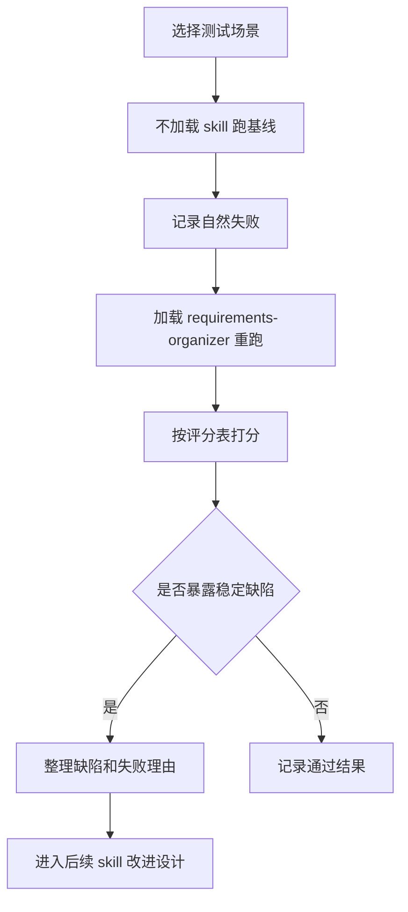

# requirements-organizer 测试夹具设计

## 1. 背景

`requirements-organizer` 用来把链接、截图、原型、在线文档或代码证据整理成中文需求文档。它现在已经覆盖主要使用场景，但缺少一套稳定的测试材料。结果是：每次调整 skill 后，只能靠临场感觉判断是否变好，很难知道它在“范围收敛、证据分层、链接失败、代码冲突、小需求快路径”等场景下是否退化。

最初计划先建设测试夹具和评分表，不改 `SKILL.md`。后续真实使用中已经暴露出稳定缺陷：可见页面元素漏采、列表字段漏采、原型字段只按用户线索补窄、流程图连线漏采、有关联项目时没有强制对照现有代码、补需求时没有解释新增内容和漏采原因。因此本轮进入修复阶段：同步更新 `SKILL.md`、输出模板和测试夹具，再用历史失败场景回放。

## 2. 目标

- 让 `requirements-organizer` 的能力、缺陷和改进效果可复测。
- 覆盖真实需求整理中最容易跑偏的场景。
- 记录无 skill 基线、加载 skill 后的表现，以及每次修改后的回归结果。
- 用评分表约束输出质量，减少“看起来不错但不可开发、不可验收”的结果。
- 把“后续 AI agent 能否继续使用”作为核心质量标准，而不是只追求人类读者觉得完整。

## 3. 主要读者

采集下来的需求主要给后续 AI agent 使用，兼顾人类产品、研发和测试复核。因此需求文档要优先满足这些条件：

- 范围、入口、前置条件、输入、输出、状态变化和验收口径必须写成显式文本，不能依赖聊天上下文。
- 截图或原型里的关键信息要转写成可检索、可引用的需求条目，不能只写“如图”“见截图”。
- 事实、推断和待确认项要分开，避免后续 AI 把猜测当成实现依据。
- 模块边界、非目标范围和缺失信息要明确，避免后续 AI 自动扩写相邻功能。
- 对开发有用的业务字段、状态、动作和约束要有稳定名称，方便后续生成代码、测试用例或任务拆分。

## 4. 不做什么

- 不为了测试夹具修改业务项目代码；skill 和模板只在确认稳定缺陷后修改。
- 不搭建复杂自动化平台。
- 不引入真实内部链接、账号、测试地址、cookie、token 或私有截图。
- 不把测试产物写进当前业务项目仓库。

## 5. 文件结构

```text
requirements-organizer/
  docs/
    2026-05-14-requirements-organizer-test-harness-design.md
  tests/
    README.md
    rubric.md
    results-template.md
    scenarios/
      01-screenshot-small-modal.md
      02-link-fails-screenshot-sufficient.md
      03-code-evidence-module.md
      04-conflicting-sources.md
      05-scope-control-large-page.md
      06-fast-output-pressure.md
      07-visible-status-inventory.md
      08-list-field-and-code-source.md
      09-flow-node-edge-replay.md
      10-reverse-small-scope.md
      11-code-comparison-required.md
      12-incremental-retrospective.md
```

## 6. 流程设计

测试夹具采用“基线 -> 加载 skill -> 记录差异 -> 定向改进”的流程。



## 7. 场景矩阵

| 场景 | 主要压力 | 重点观察 |
| --- | --- | --- |
| 截图小弹窗 | 只有局部截图，信息不完整 | 是否只写能确认的交互，不脑补按钮和字段 |
| 链接失败但截图足够 | 页面不可读，用户想快 | 是否及时转截图主导模式，而不是卡在浏览器读取 |
| 代码证据模块 | 只有模块名和仓库代码 | 是否快速锁定 3 到 6 个锚点文件，避免全仓考古 |
| 多来源冲突 | 原型、文档、代码说法不一致 | 是否拆开写“原型期望”“代码现状”“待确认项” |
| 大页面范围收敛 | 页面内容很多，用户只指定一块 | 是否拒绝扩写整页 PRD |
| 快速输出压力 | 用户要求先给可用初版 | 是否优先输出开发可用版本，保留关键缺口 |
| AI 接续使用 | 后续 agent 要基于文档开发或测试 | 是否提供明确边界、稳定字段、验收点和未确认项 |
| 可见状态清点 | 截图里有明确状态标签 | 是否把可见状态先当作原型事实，不推回给用户确认 |
| 列表字段与代码源头 | 列表页有行内元信息，用户给出字段猜测 | 是否先列全可见字段，再回查 DTO、模型、枚举和接口定义 |
| 流程节点与连线 | 原型包含节点、箭头、颜色或分组 | 是否同时输出节点状态矩阵和连线清单，低置信关系进入待确认 |
| 反向小范围 | 用户只要一个按钮或小弹窗 | 是否不过度输出完整页面清册，只保留会影响开发和验收的元素 |
| 关联项目必须代码对照 | 原型页和当前仓库有关 | 是否把关键元素映射到现有实现、缺口、冲突或外部边界 |
| 增量复盘 | 用户追问新增、漏采原因和修复是否合格 | 是否说明新增内容、漏采原因、补齐关联和未解决边界 |

## 8. 评分表

总分按 100 分折算。每项 0 到 10 分，执行时选取与场景相关的 10 个维度，或按所有适用维度平均后折算。

| 维度 | 10 分标准 | 低分表现 |
| --- | --- | --- |
| 范围控制 | 只覆盖用户指定模块，并明确不覆盖内容 | 扩写整页、整系统或无关链路 |
| 证据分层 | 正确使用 `[明确]`、`[推断]`、`[待确认]` | 把推断写成事实，或不标证据类型 |
| 元素完整性 | 可见字段、状态、动作、筛选、分页、反馈和跳转已进入需求、信息缺口或排除说明 | 截图或原型里明显可见的元素被静默遗漏 |
| 关联完整性 | 关键元素能映射到需求、数据项、代码/文档锚点或信息缺口 | 只描述页面观感，没有说明字段来源、状态来源或实现边界 |
| 代码对照完整性 | 有关联项目或用户要求结合代码时，关键需求都能对应现有实现、缺口、冲突或外部边界 | 只整理原型，不查现有代码；或只说“未发现接口” |
| 可开发性 | 入口、交互、状态、边界、验收口径清楚 | 只有页面描述，没有实现和验收信息 |
| AI 可执行性 | 后续 AI 能直接拆任务、写代码或生成测试 | 依赖上下文、截图指代、口头省略或字段命名混乱 |
| 克制程度 | 不补无证据按钮、字段、权限、跳转 | 用“通常”“可能”“应该”扩写需求 |
| 效率策略 | 页面失败、信息不足时能换策略并给出初版 | 反复读取、反复追问、迟迟不给结果 |
| 中文表达 | 直接、自然、少模板腔，能给研发和测试使用 | 空泛、宣传腔、AI 味重，重点被套话淹没 |
| 复测闭环 | 说明原历史问题是否被覆盖，并列出未覆盖风险 | 只说“已优化”，没有回放原问题 |
| 增量复盘 | 说明新增/修正了什么、上一版为什么漏、本轮补了哪些关联、还有哪些未解决 | 只列新增内容，不解释漏采原因和未闭环边界 |

建议判定：

- 90 到 100 分：通过，可作为优秀样例保留。
- 76 到 89 分：可用，但需要记录改进点。
- 60 到 75 分：暴露明显缺陷，进入后续 skill 改进。
- 59 分及以下：场景失败，需要优先修。

硬性失败条件：

- 截图或原型里明确可见的字段、状态、按钮、跳转或列表元信息被静默遗漏。
- 把可见事实推回给用户确认，例如截图里已经有“未扫描”，却仍要求用户确认是否展示未扫描学生。
- 用户给出字段猜测后，不回查 DTO、模型、枚举、接口说明或旧文档，就把猜测写成确定契约。
- 当前任务有关联项目或用户要求结合代码，但输出没有做需求-代码对照。
- 只按同名 Controller 或接口名搜索，找不到就判为无关联，没有检查 DTO、模型、枚举、异步消费者、消息、外部适配或旧文档。
- 补需求或复测需求时，只说新增了什么，不说明上一版漏掉原因、补齐的关联和仍未解决问题。
- 流程图、状态图或页面连线里有可见连线，但输出只写节点文字，不说明连线方向、低置信关系或待确认项。
- 原型、旧文档和代码冲突时混写成一个结论。

## 9. 结果记录

每次测试记录以下内容：

- 测试日期、模型、是否加载 skill。
- 使用的场景文件。
- 原始输出摘要。
- 评分表结果。
- 失败片段或失败理由，尽量保留原话。
- 后续 AI 使用风险，例如范围歧义、字段缺失、验收不可判定、截图指代过多。
- 下一步建议：不改、改测试、改模板、改 `SKILL.md`、拆引用资料。

## 10. 后续改进门禁

只有满足下面任一条件，才修改 `SKILL.md` 或引用资料：

- 同一缺陷在 2 个以上场景复现。
- 某个缺陷导致评分低于 45 分。
- 缺陷属于安全、隐私、范围失控或证据伪造。
- 缺陷会让后续 AI agent 无法独立使用需求文档继续开发、测试或拆任务。
- 用户明确要求把某条规则沉淀进 skill。

改动后必须重跑相关场景，并在结果记录里标明是否回归通过。

## 11. Markdown 自检

- 代码围栏已闭合。
- Mermaid 使用保守语法：英文节点 ID、短中文节点文案、基础箭头。
- 图表覆盖测试流程，表格覆盖场景矩阵和评分标准。
- 文档不依赖聊天上下文，可独立说明本次测试夹具设计。
